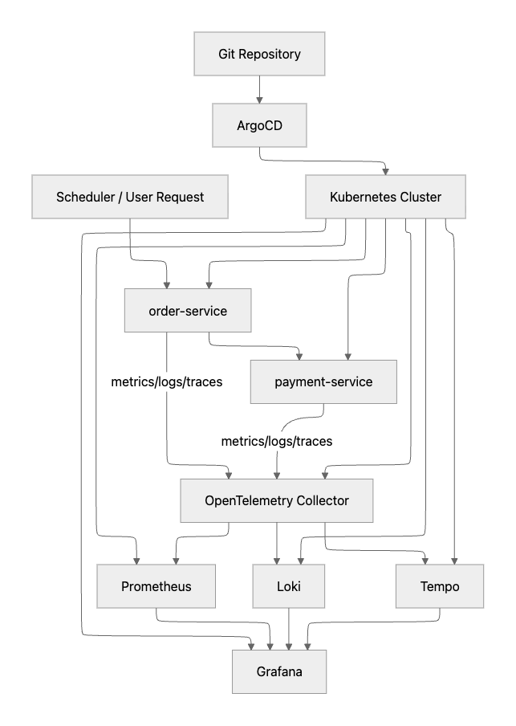
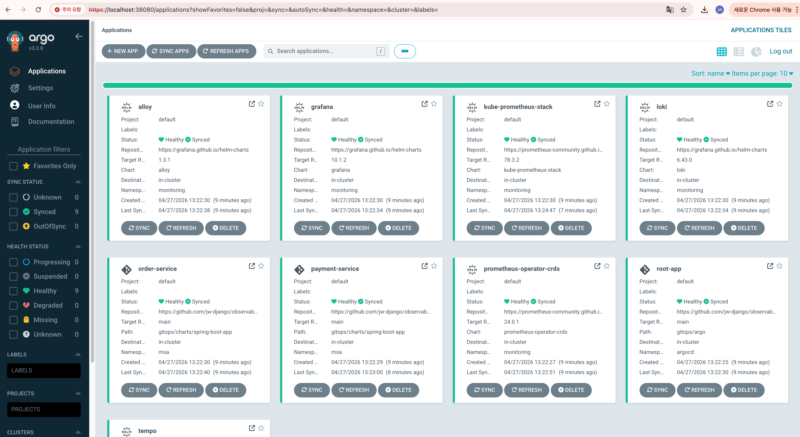
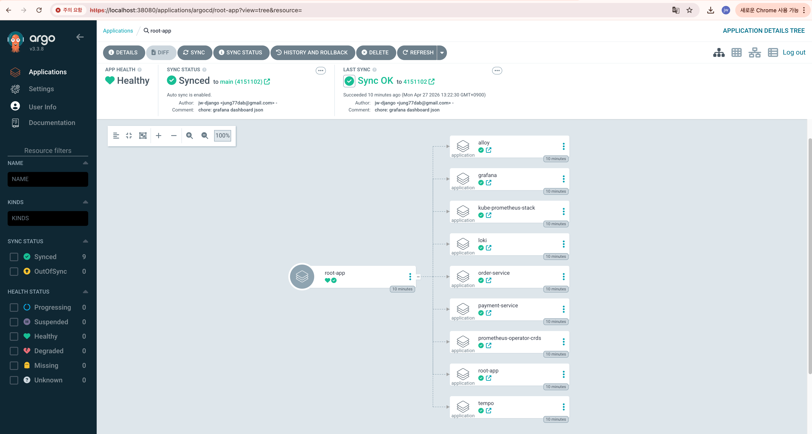
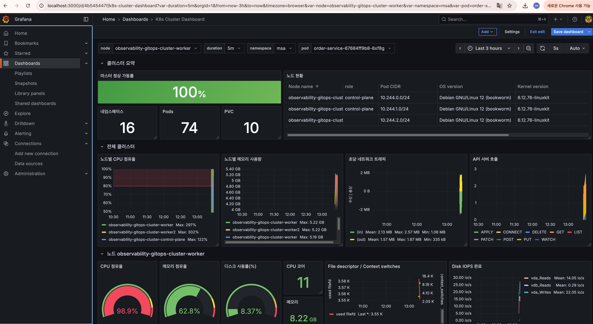
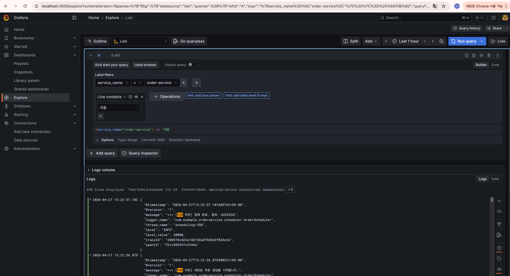
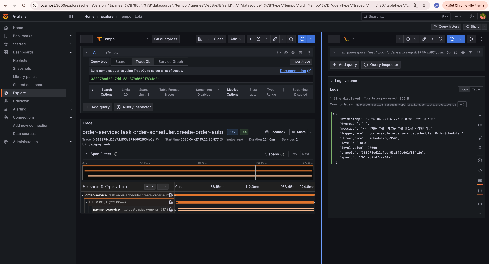

# Production-like GitOps & Observability Environment (with Kind)

로컬 Kubernetes 환경에서 GitOps(ArgoCD)와 Observability(PLG + Tracing)를  
실제 운영 환경 수준으로 재현한 프로젝트입니다.

---

## Why This Project

실제 서비스에서 AWS EKS 기반 Kubernetes 환경과  
ArgoCD를 활용한 GitOps, 그리고 Prometheus/Loki/Grafana/Tempo 스택을 구축하며 운영 경험을 쌓았습니다.

본 프로젝트는 이러한 **실무 환경을 로컬(kind)** 에서 재현하여  
- GitOps 기반 배포 흐름  
- Observability 구성 방식  
- 서비스 운영 구조  

를 검증하고 정리하기 위해 구성했습니다.
특히, 서비스 간 호출 흐름에서 발생하는 Metrics, Logs, Tracing을 통합적으로 관측하는 것을 목표로 합니다.

---

## Architecture

본 프로젝트는 Observability 검증을 위한 최소한의 MSA 구조로 구성되어 있습니다.

- order-service: 주기적으로 요청을 생성하는 스케줄러 역할(사용자 요청을 가정)
- payment-service: 요청을 처리하고 응답 반환

서비스 간 호출을 통해 Metrics, Logs, Tracing 데이터가 발생하도록 설계했습니다.



## Tech Stack

- **Kubernetes**: kind (local cluster)
- **GitOps**: ArgoCD (App of Apps pattern)
- **Monitoring**
  - Prometheus (Metrics)
  - Loki (Logs)
  - Tempo (Tracing)
  - Grafana (Visualization)
- **Automation**: Makefile

---

## Prerequisites
시작하기 전 아래 도구들이 설치되어 있어야 합니다.

- Docker
- kind (`brew install kind`)
- kubectl (`brew install kubernetes-cli`)


## Quick Start

모든 인프라 구축은 루트 디렉토리 내의 Makefile을 통해 자동화되어 있습니다.

### 1. 클러스터 생성
```
make cluster-up
```
- 1개의 Master 노드와 2개의 Worker 노드 생성

### 2. ArgoCD 설치
```
make argocd-install
```

### 3. GitOps Root App 배포
```
kubectl apply -f gitops/argo/root-app.yaml
```
- App of Apps 패턴으로 전체 리소스 자동 배포

### 4. ArgoCD UI 접속
```
# 초기 비밀번호 확인
make argocd-pw

# 포트 포워딩
make argocd-pf
```
- 접속: localhost:38080
- ID: admin / PW: 출력값 확인

### 5. Grafana UI 접속
```
# 포트 포워딩
make grafana-pf
```
- 접속: localhost:3000
- ID: admin / PW: admin

### 6. 통합 대시보드 시각화 (Grafana)
- `docs/k8s-cluster-dashboard.json` import


### 7. 클러스터 삭제
```
make cluster-down
```

---

## Screenshots

### 1. ArgoCD - GitOps Deployment




App of Apps 패턴을 통해 Prometheus, Loki, Grafana 등 모든 리소스를
선언적으로 관리하고 있습니다.

---

### 2. Grafana - Cluster Monitoring



Kubernetes 클러스터의 CPU, Memory, Pod 상태를 통합적으로 모니터링합니다.

---

### 3. Observability - Logs (Loki)



Loki를 통해 Kubernetes 로그를 수집하고 필터링하여 조회할 수 있습니다.

---

### 4. Observability - Tracing (Tempo)



OpenTelemetry 기반 트레이싱을 통해 order-service → payment-service 간 요청 흐름을 추적할 수 있습니다.

## Observability Stack
- Metrics: Prometheus
- Logs: Loki
- Tracing: Tempo
- Visualization: Grafana

## Troubleshooting
### 1. ArgoCD 리소스 적용 순서 문제
- 문제: App of Apps 구조에서 일부 리소스가 먼저 생성되어야 했지만 순서가 보장되지 않음
- 해결: ArgoCD sync wave 설정을 통해 적용 순서 제어


## Production Considerations
실제 운영 환경에서는 다음과 같이 확장 가능합니다:
- AWS EKS 기반 클러스터 구성
- ALB / Ingress Controller 적용
- HPA + Cluster Autoscaler
- Terraform 기반 IaC 통합
